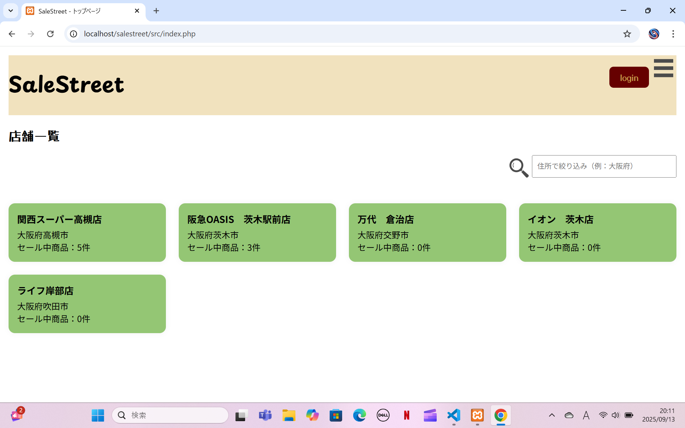
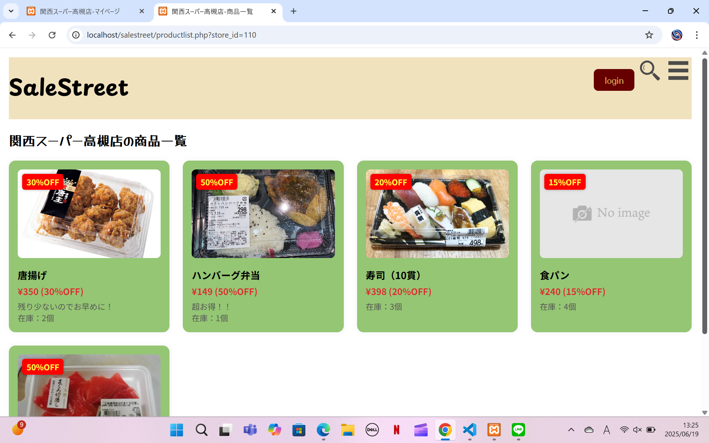
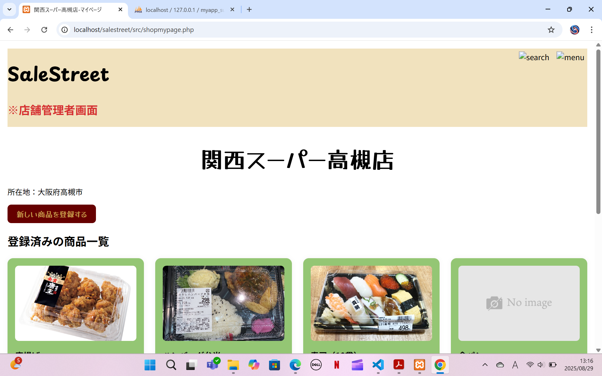
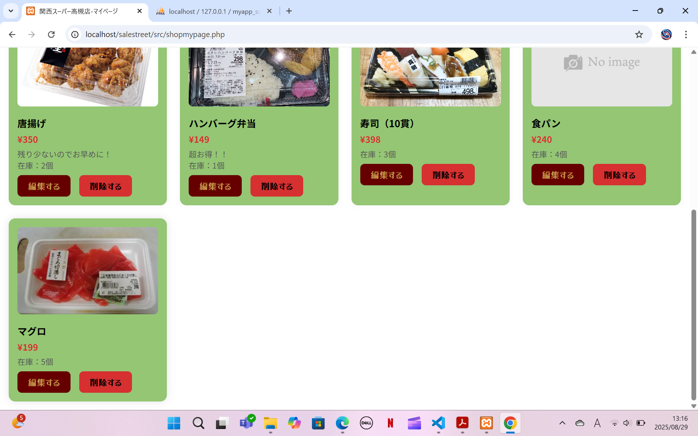

# SaleStreet(スーパーマーケットの売れ残りお知らせサービス)

## 概要
スーパーで閉店時間近くに発生する売れ残り商品を、利用者がリアルタイムで確認できるサービスです。  
利用者にとってはお得な買い物につながり、店舗にとっては食品廃棄を減らしながら売上の向上も期待できます。  
現在も開発中で、進捗を都度更新する予定です。

## 開発のきっかけ
本アプリケーションを開発した理由は、身近な課題を解決し、社会の役に立てる仕組みを作りたいと考えたためです。
きっかけは、私自身の生活体験にあります。ある日、閉店間際のスーパーマーケットに立ち寄った際、多くの惣菜や生鮮食品が売れ残っている光景を目にしました。これらの商品は多くが半額で販売されており、「この価格であれば購入したい」と思えるものが数多くありました。しかし、実際にはその情報を事前に知ることができないため、その日に何がセール対象として売れ残っているかわからず店を訪れるに至らなかったり、来店のタイミング次第で購入機会を逃してしまうという問題があります。

この経験を通じて、私は「セール情報をリアルタイムに共有できれば、消費者はより賢く買い物ができ、店舗側も廃棄を減らしつつ売上向上につなげられるのではないか」と考えました。特に食品ロスは社会的にも大きな課題であり、環境問題や持続可能性の観点からも注目されています。もし売れ残りの情報をオンラインで発信できる仕組みがあれば、消費者にとっては「お得に商品を購入できる利便性」、店舗にとっては「在庫処分の効率化と利益確保」、そして社会全体にとっては「食品廃棄の削減」という効果が期待できると考え本アプリケーションの開発を試みました。

生活の中で課題を発見し、技術を使って解決策を実際に形にすることは、開発者としての成長にもつながると考えています。本アプリケーションはその第一歩であり、まだ簡単な機能のみの実装ですが、社会的意義を持つサービスへと発展し得る可能性を意識して取り組みました。

## 使用技術
- PHP
- MySQL
- HTML/CSS
- JavaScript

## 機能

- 利用者が店舗を選択できる画面（トップページ）
  - 住所により表示される店舗を絞り込める機能

- 利用者が商品一覧を閲覧できる画面

- 店舗が商品を登録、編集できる管理画面
  - 店舗側が新しい商品を登録できる機能
  - 店舗側が既存の商品を編集、削除できる機能

- 将来的には商品のレコメンド機能やキープ機能を追加予定

## 工夫した点
- フードロス削減を意識したアイデア
- 利用者目線のシンプルで親しみやすいUI設計
- データベース設計を正規化して拡張性を確保

## 使い方

1. [XAMPP](https://www.apachefriends.org/jp/index.html) をインストールします。

2. このリポジトリを `htdocs` ディレクトリに配置します。
   例: `C:\xampp\htdocs\salestreet`

3. XAMPPコントロールパネルから Apache と MySQL を起動します。

4. MySQLに適切なデータベースを作成します。
   ※初期化用のSQLファイルは今後公開予定です

5. ブラウザで以下のURLにアクセスするとアプリケーションが動作します。
      [localhost/salestreet/src/index.php](http://localhost/salestreet/src/index.php)

## スクリーンショット

トップページ  

商品一覧ページ  

店舗用管理画面

